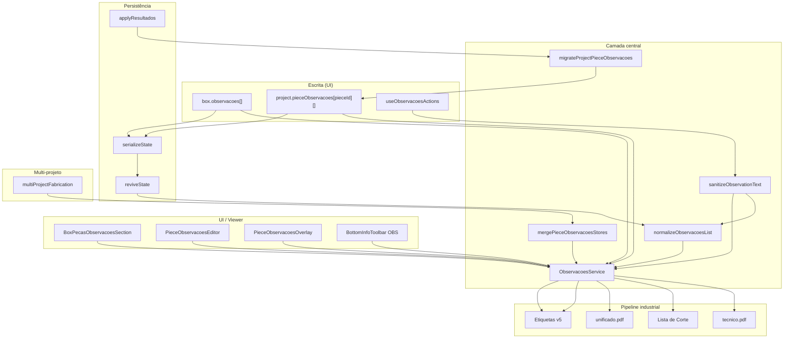

# PIMO.PRO-V5 — Sistema Unificado de Observações

**Documento:** evolução futura e contratos de regressão  
**Estado da implementação base:** consolidado e oficial (`src/core/observacoes/`)  
**Última actualização:** Junho 2026

> Este documento **não altera** a implementação actual. Regista o padrão oficial fixado e prepara três blocos de evolução para desenvolvimento posterior.

**Referências:**

- Implementação actual: [`src/core/observacoes/README.md`](../src/core/observacoes/README.md)
- Regra Cursor: [`.cursor/rules/observacoes-unificado.mdc`](../.cursor/rules/observacoes-unificado.mdc)
- Roadmap interactivo: [`src/core/docs/projectRoadmap.ts`](../src/core/docs/projectRoadmap.ts) — `phase_5d_observacoes_pimo_pro_v5`

---

## Estado oficial (baseline — não alterar sem ADR)

| Campo | Tipo | Âmbito |
|-------|------|--------|
| `box.observacoes` | `string[]` | Observações da caixa |
| `project.pieceObservacoes` | `Record<pieceId, string[]>` | Observações por peça |

Camada central obrigatória: **`ObservacoesService.ts`**. Contrato de testes: **21 testes** verdes.

```bash
npx vitest run src/core/observacoes/ src/core/pdf/labelObservationsV5.test.ts
```

---

## Bloco 1 — Observações Avançadas: Evolução Futura

> **Status:** planeado · **Prioridade:** pós-consolidação · **Pré-requisito:** Sistema Unificado v1 estável

### 1.1 Observações categorizadas

Evoluir de `string[]` para entradas tipadas:

```typescript
type ObservacaoCategoria =
  | "industrial"
  | "qualidade"
  | "montagem"
  | "campo"
  | "cliente"
  | "design";

type ObservacaoEntry = {
  categoria: ObservacaoCategoria;
  texto: string;
};
```

**Requisitos de produto:**

- Cada observação = `{ categoria, texto }`
- Suporte a ícones e cores por categoria na UI (Box, Viewer, Overlay)
- Sanitização e deduplicação continuam centralizadas no `ObservacoesService`
- Migração incremental: `string[]` legado → `{ categoria: "industrial", texto }` na carga (sem perda)

**Impacto estimado:** `observacoesTypes.ts`, UI (`PieceObservacoesEditor`, badges), formatação PDF/etiquetas (prefixo ou cor por categoria).

### 1.2 Templates industriais de observações

Biblioteca de templates reutilizáveis, seleccionáveis na UI:

| Dimensão | Exemplos |
|----------|----------|
| Tipo de peça | Porta, gaveta, lateral, prateleira, costa |
| Tipo de projeto | Cozinha, Roupeiro, Escritório |
| Material | MDF, Lacado, Aglomerado |

**Comportamento:**

- Seleccionar um template **adiciona** observações automaticamente à peça ou caixa (via `ObservacoesService`, nunca escrita directa)
- Templates armazenados em JSON (admin) ou catálogo interno versionado
- Deduplicação após aplicação do template

**Entregáveis futuros:**

- `ObservacoesTemplateService` (ou extensão do `ObservacoesService`)
- UI de selecção em `BoxPecasObservacoesSection`
- Testes de aplicação de template + idempotência

### 1.3 Notas automáticas por regra (Rule-Based Observations)

Motor de regras configuráveis (JSON + UI Admin) que **sugere ou adiciona** observações com base em contexto da peça:

| Regra (exemplo) | Acção |
|-----------------|-------|
| Peça > X mm (largura/altura) | Adicionar nota de manuseamento |
| Material = Lacado | `"Superfície sensível"` |
| Porta sem puxador | `"Sistema Push-Open"` |
| Furos especiais detectados | Nota automática de furação |

**Arquitectura proposta:**

```
Rules JSON (admin) → RuleBasedObservationsEngine → ObservacoesService → pieceObservacoes
```

**Restrições:**

- Regras **nunca** escrevem directamente em `metadata`, `piece.notes` ou campos legados
- Recompute: regras só **adicionam** notas novas; nunca sobrescrevem observações manuais
- Opt-in por projeto ou fábrica (feature flag)

**Entregáveis futuros:**

- Schema JSON de regras + validador
- Integração com `dynamic-rules` / `rules-engine` existente
- UI Admin para CRUD de regras
- Testes de regra + recompute + persistência

---

## Bloco 2 — Observações: Regression Checklist

Checklist obrigatório antes de merge em qualquer alteração que toque observações, PDFs, etiquetas, persistência ou UI relacionada.

### Dados e persistência

- [ ] `pieceObservacoes` **nunca** é sobrescrito no `applyResultados` / recompute
- [ ] Roundtrip `serializeState` / `reviveState` preserva `pieceObservacoes` e `box.observacoes`
- [ ] Fabricação multi-projeto funde stores via `mergePieceObservacoesStores` sem duplicar
- [ ] Migração legado só na carga; nunca sobrescreve entradas existentes

### Sanitização e normalização

- [ ] `sanitizeObservationText()` activo em toda escrita (HTML, newlines, control chars, limite 240)
- [ ] `normalizeObservacoesList()` activo em toda leitura/normalização
- [ ] Deduplicação preserva ordem

### Arquitectura

- [ ] `ObservacoesService` é a **única** fonte de verdade para leitura/resolução/export
- [ ] Nenhuma leitura de `metadata.observacao` / `obs` / `observacoes` na pipeline industrial
- [ ] Nenhuma escrita ou leitura de `piece.notes` (Pimo-Trak) no domínio de observações
- [ ] Nenhum fallback a `rules.etiqueta.observacoesPadrao` ou `runtime.observations`

### Pipeline industrial (mesma origem)

- [ ] `gerarPdfTecnico.ts` — `resolveObservacoesForCutListItem` + `pieceObservacoes`
- [ ] `pdfCutlist.ts` — idem
- [ ] `pdfUnified.ts` — passa `pieceObservacoes`
- [ ] `pdfEtiquetas.ts` / `UnifiedEtiquetaEngine` — `collectObservationsForItem` + `pieceObservacoes`
- [ ] `multiProjectFabrication.ts` — merge de stores
- [ ] `useProjectExportActions.ts` / `useGerarArquivoHandlers.ts` — incluem `pieceObservacoes`

### UI

- [ ] `BoxPecasObservacoesSection` + `PieceObservacoesEditor` usam `ObservacoesService`
- [ ] Viewer: badge OBS + `PieceObservacoesOverlay` usam `getPieceObservacoes` / `hasObservacoes`
- [ ] `useObservacoesActions` centraliza escrita

### Testes

- [ ] **21 testes** do contrato oficial continuam verdes
- [ ] Qualquer nova feature passa pelo `ObservacoesService` e adiciona testes ao contrato

```bash
npx vitest run src/core/observacoes/ src/core/pdf/labelObservationsV5.test.ts
```

---

## Bloco 3 — Observações: Diagramas Arquiteturais

### 3.1 Fluxo de dados (Mermaid)



### 3.2 Relações e camadas (PlantUML)

Ficheiro standalone: [`pimo-pro-v5-observacoes-architecture.puml`](./pimo-pro-v5-observacoes-architecture.puml)

```plantuml
@startuml PIMO-PRO-V5-Observacoes
!theme plain
skinparam componentStyle rectangle

package "Modelo de dados" {
  class WorkspaceBox {
    observacoes: string[]
  }
  class ProjectState {
    pieceObservacoes: Record<pieceId, string[]>
  }
  class CutListItem {
    metadata.panelId
  }
}

package "ObservacoesService\n(fonte única)" #LightBlue {
  component Sanitize
  component Normalize
  component ResolveIndustrial
  component MigrateLegacy
  component MergeMultiProject
  component FormatPdf
}

package "UI" #LightGreen {
  component BoxPecasObservacoesSection
  component PieceObservacoesEditor
  component PieceObservacoesOverlay
  component useObservacoesActions
}

package "Viewer" #LightGreen {
  component BottomInfoToolbar
}

package "Pipeline industrial" #LightYellow {
  component gerarPdfTecnico
  component pdfCutlist
  component pdfUnified
  component pdfEtiquetas
  component UnifiedEtiquetaEngine
  component multiProjectFabrication
}

package "Persistência" #Wheat {
  component projectPersistence
  component projectState
}

package "Domínio separado\n(nunca misturar)" #Pink {
  component PimoTrakNotes as "piece.notes\n(Pimo-Trak)"
  component MaterialObs as "materials.api\nobservacoes"
}

WorkspaceBox --> useObservacoesActions
ProjectState --> useObservacoesActions
useObservacoesActions --> Sanitize
Sanitize --> Normalize

BoxPecasObservacoesSection --> ResolveIndustrial
PieceObservacoesOverlay --> ResolveIndustrial
BottomInfoToolbar --> ResolveIndustrial

ProjectState --> ResolveIndustrial
CutListItem --> ResolveIndustrial

ResolveIndustrial --> gerarPdfTecnico
ResolveIndustrial --> pdfCutlist
ResolveIndustrial --> pdfUnified
ResolveIndustrial --> pdfEtiquetas
ResolveIndustrial --> UnifiedEtiquetaEngine

ProjectState --> MergeMultiProject
MergeMultiProject --> multiProjectFabrication
multiProjectFabrication --> pdfEtiquetas

projectPersistence --> Normalize
projectState --> MigrateLegacy
MigrateLegacy ..> ProjectState : só na carga

PimoTrakNotes -[hidden]- MaterialObs

note right of ObservacoesService
  Implementação oficial fixada.
  Evolução futura (Bloco 1) deve
  estender este serviço, nunca
  criar caminho paralelo.
end note

@enduml
```

---

## Roadmap PIMO.PRO-V5 (resumo)

| Item | Fase | Status |
|------|------|--------|
| Sistema Unificado v1 (`ObservacoesService`) | `phase_5d_observacoes_pimo_pro_v5` | Concluído |
| Observações categorizadas | `phase_5d_observacoes_pimo_pro_v5` | Planeado |
| Templates industriais | `phase_5d_observacoes_pimo_pro_v5` | Planeado |
| Notas automáticas por regra | `phase_5d_observacoes_pimo_pro_v5` | Planeado |

---

## Evolução futura — regras inegociáveis

1. Toda alteração passa pelo `ObservacoesService`
2. Manter `box.observacoes` + `pieceObservacoes` como modelo base (extensível, não substituível por paralelos)
3. Preservar compatibilidade com pipeline industrial
4. Executar Bloco 2 (Regression Checklist) em cada PR
5. Manter 21+ testes verdes; novas features expandem o contrato
